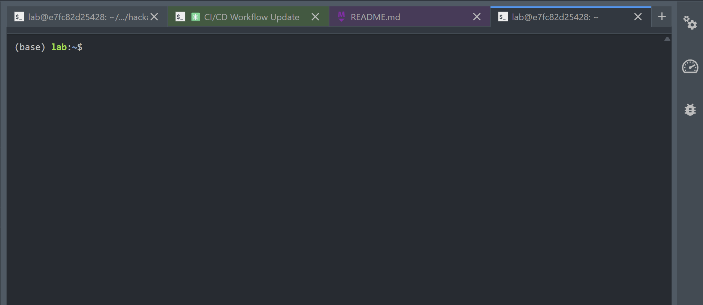
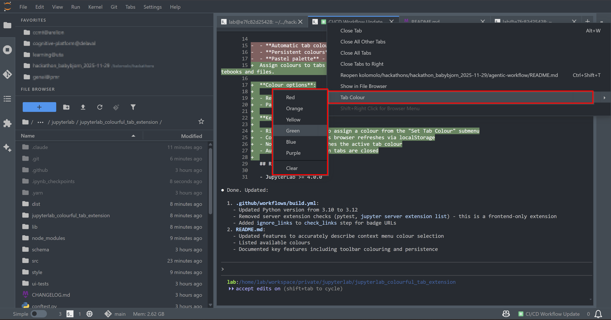

# jupyterlab_colourful_tab_extension

[](https://github.com/stellarshenson/jupyterlab_colourful_tab_extension/actions/workflows/build.yml)
[](https://www.npmjs.com/package/jupyterlab_colourful_tab_extension)
[](https://pypi.org/project/jupyterlab-colourful-tab-extension/)
[](https://pepy.tech/project/jupyterlab-colourful-tab-extension)
[](https://jupyterlab.readthedocs.io/en/stable/)
[](https://kolomolo.com)
[](https://www.paypal.com/donate/?hosted_button_id=B4KPBJDLLXTSA)

A JupyterLab extension that applies pastel colours to tabs for visual identification when many tabs are open.

Coloured tabs make it easy to identify different notebooks and files at a glance.



Right-click any tab to select a colour from the "Tab Colour" submenu.



## Features

Assign colours to tabs via right-click context menu for easy visual identification when working with multiple notebooks and files.

**Colour options**:

- Red, Orange, Yellow, Green, Blue, Purple
- Pastel shades optimised for both light and dark themes

**Key features**:

- Right-click any tab to assign a colour from the "Set Tab Colour" submenu
- Colours persist across browser refreshes via localStorage
- Notebook toolbar matches the active tab colour
- Automatic cleanup when tabs are closed

## Requirements

- JupyterLab >= 4.0.0

## Install

To install the extension, execute:

```bash
pip install jupyterlab_colourful_tab_extension
```

## Uninstall

To remove the extension, execute:

```bash
pip uninstall jupyterlab_colourful_tab_extension
```
