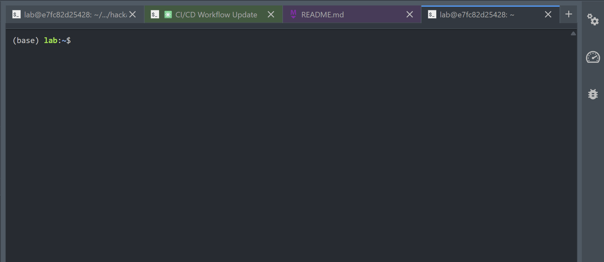
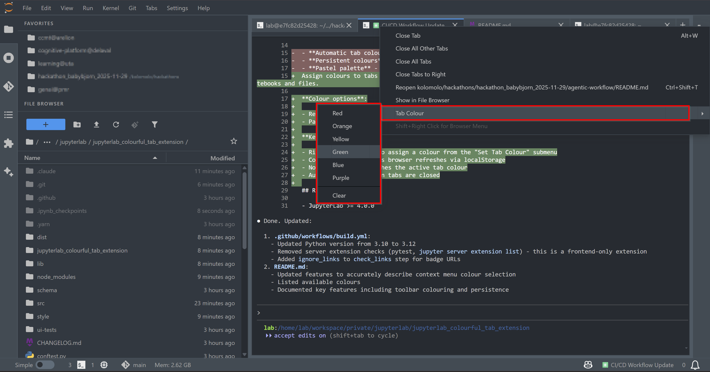

# jupyterlab_colourful_tab_extension

[](https://github.com/stellarshenson/jupyterlab_colourful_tab_extension/actions/workflows/build.yml)
[](https://www.npmjs.com/package/jupyterlab_colourful_tab_extension)
[](https://pypi.org/project/jupyterlab-colourful-tab-extension/)
[](https://pepy.tech/project/jupyterlab-colourful-tab-extension)
[](https://jupyterlab.readthedocs.io/en/stable/)
[](https://kolomolo.com)
[](https://www.paypal.com/donate/?hosted_button_id=B4KPBJDLLXTSA)

> [!TIP]
> This extension is part of the [stellars_jupyterlab_extensions](https://github.com/stellarshenson/stellars_jupyterlab_extensions) metapackage. Install all Stellars extensions at once: `pip install stellars_jupyterlab_extensions`

A JupyterLab extension that applies pastel colours to tabs for visual identification when many tabs are open.

Coloured tabs make it easy to identify different notebooks and files at a glance.



Right-click any tab to select a colour from the "Tab Colour" submenu.



## Features

Assign colours to tabs via right-click context menu for easy visual identification when working with multiple notebooks and files.

**Colour options**:

- Red, Orange, Yellow, Green, Blue, Purple
- Pastel shades optimised for both light and dark themes

**Key features**:

- Right-click any tab to assign a colour from the "Set Tab Colour" submenu
- Selected (active) tab shows a distinct shade of its colour so it stands out from other coloured tabs
- Colours persist across browser refreshes via localStorage - a file keeps its colour by path, a terminal for as long as its session runs
- Notebook toolbar matches the active tab colour
- Adjacent tabs sharing the same colour keep a visible divider: the 1px seam between them is recoloured with a contrastive grey computed from the tab colour (darker in the light theme, brighter in the dark theme), toggleable via the `dynamicDivider` setting
- Editable palette in the Settings Editor (Settings → Colourful Tabs): inactive and active shades per colour name, for both themes - edits apply live to tabs, toolbar, menu swatches and divider greys
- A terminal's colour is released once its session ends, so the next terminal to reuse that number starts clear
- Tabs with no lasting identity of their own (the launcher, for example) can still be coloured, but the colour lasts only for the session

Yes, this is yet another mass-produced JupyterLab extension that does one trivially simple thing. We are almost embarrassed by how utterly unremarkable it is - just some CSS classes and a context menu. But someone had to do it, and here we are. You're welcome.

## Requirements

- JupyterLab >= 4.0.0

## Install

To install the extension, execute:

```bash
pip install jupyterlab_colourful_tab_extension
```

## Uninstall

To remove the extension, execute:

```bash
pip uninstall jupyterlab_colourful_tab_extension
```

## Extension API

Other extensions can tint a widget's tab programmatically via the public `IColourfulTabs` token.

- Import the token from `jupyterlab_colourful_tab_extension` and request it as an `optional` (or `requires`) plugin dependency
- Call `setColour(widget, colourId)` where `colourId` is one of `rose`, `peach`, `lemon`, `mint`, `sky`, `lavender`, or `null` to clear
- The tint rides the widget's Lumino `title.className`, so it survives tab re-renders and reordering with no DOM querying
- Programmatic colours are independent of the right-click menu's localStorage-persisted colours

```ts
import {
  JupyterFrontEnd,
  JupyterFrontEndPlugin
} from '@jupyterlab/application';
import { IColourfulTabs } from 'jupyterlab_colourful_tab_extension';

const plugin: JupyterFrontEndPlugin<void> = {
  id: 'my_extension:plugin',
  autoStart: true,
  optional: [IColourfulTabs],
  activate: (app: JupyterFrontEnd, colourfulTabs: IColourfulTabs | null) => {
    if (colourfulTabs) {
      colourfulTabs.setColour(widget, 'sky');
    }
  }
};
```

> [!IMPORTANT]
> The consumer must declare `jupyterlab_colourful_tab_extension` as a shared `singleton` in its `package.json` `jupyterlab.sharedPackages` block (with `"bundled": false`). Without it, module federation serves two copies of the token and the `optional` dependency silently resolves to `null`.
